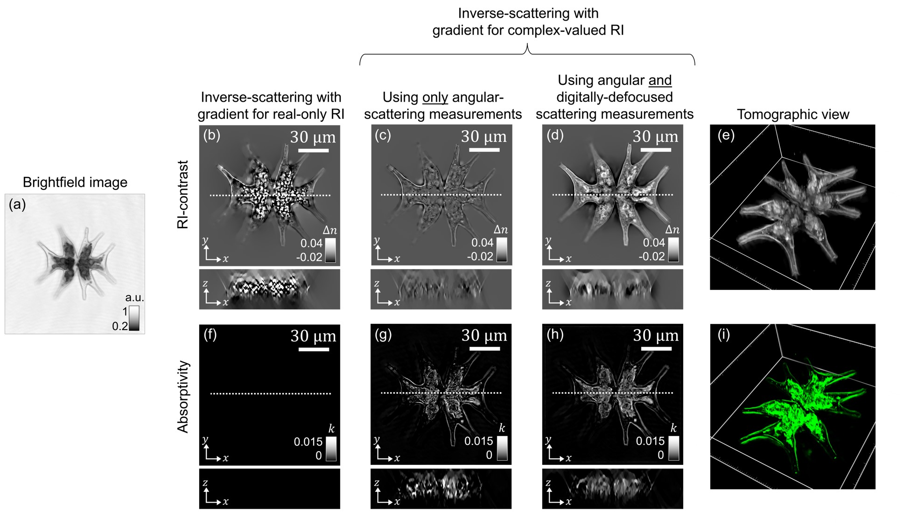
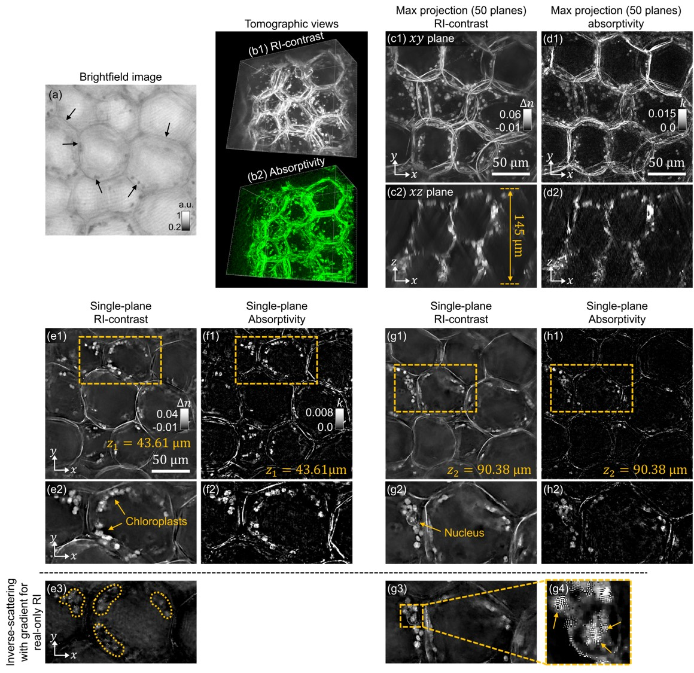
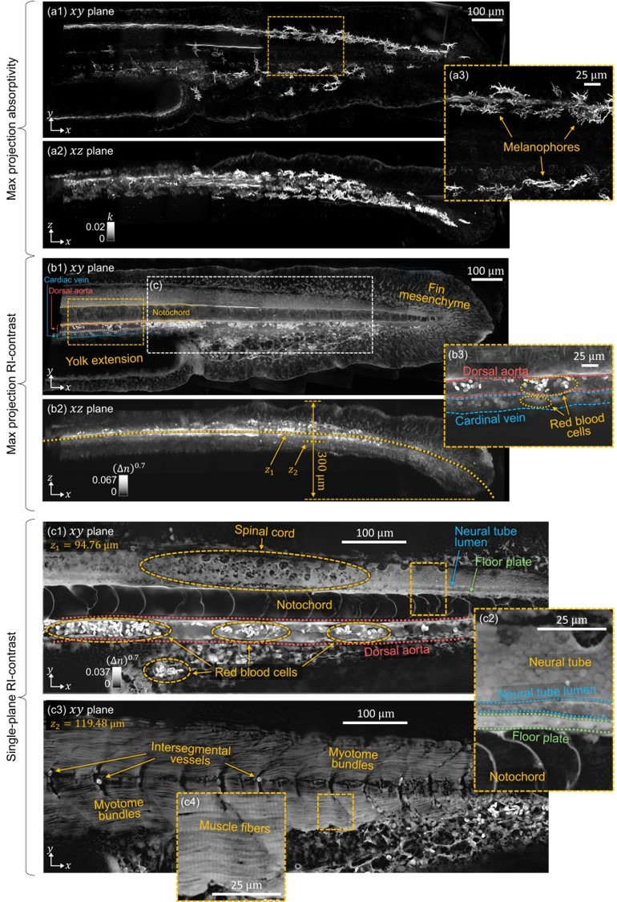

# Inverse scattering of absorptive samples via beam propagation

This repository contains the MATLAB reconstruction code for MSBP-based inverse-scattering to recover the sample's three-dimensional complex-valued refractive index, as used in the following publication:

[**Wagenaar, Peter, et al. "Inverse-scattering of absorptive samples via beam propagation." bioRxiv (2026).**](https://www.biorxiv.org/content/10.64898/2026.04.21.719764v1).

**Abstract**:
Inverse-scattering methods enable label-free, quantitative visualization of a sample’s three-dimensional (3D) refractive index (RI), providing intrinsic and volumetric morphological contrast without exogenous labels. This is achieved by developing computational frameworks that reconstruct the sample’s 3D RI from a series of scattering measurements acquired under different data-capture conditions. Recent advances have demonstrated successful 3D RI reconstructions in multiple-scattering samples using angle-varying illuminations; however, these studies have primarily focused on non-absorptive samples. Here, we extend the multi-slice beam propagation (MSBP) inverse-scattering framework to reconstruct *complex-valued* RI, encompassing *both* the sample’s conventional RI (real part) and absorptivity (imaginary part). We show that reconstructing complex-valued RI makes the inverse problem ill-posed under angle-varying illumination alone, and that incorporating measurement diversity from *both* angle-varying illumination *and* sample defocus is necessary to ensure stable and accurate convergence. Experimental demonstrations were conducted on 1) dyed microsphere samples to characterize accuracy of reconstructed RI and absorptivity; and 2) diverse absorptive scattering samples to demonstrate biological utility. These results represent an important step for label-free volumetric imaging in biological tissue, which typically exhibits *both* scattering *and* absorption.

# Experimental dataset

The experimental dataset for running the code can be downloaded from the link below. This dataset contains angular scattering measurements (complex-field measurements) of absorptive microspheres, algae, succulent tissue section, and pigmented zebrafish embryo. Parameters of the angle-scanning imaging system and parameters used for MSBP-based inverse scattering are also included.

[**Download Link**](https://dataverse.tdl.org/dataverse/bpm_based_inverse-scattering-in-absorptive-samples)

# Running the code
To run the complex-valued multi-slice beam propagation inverse-scattering code, please follow the steps outlined below:
  1. Download/Clone the repository onto your local machine and unzip if necessary. You should see       a main file and a utils folder.
  2. To reconstruct the data found in the paper, download the data from the link provided in the        **Expiremental Dataset** section.
  3. mainMSBP.mat describes in detail how to run the code, please read the comments and run the         code block by block.

# Expiremental Results
<table align="center">
  <tr>
    <td align="center">
       
      <strong>Figure 1:</strong> Experimental complex-valued reconstruction of <i>Micrasterias Radiata</i>
       
       
      <strong>Figure 2:</strong> Experimental complex-valued reconstruction of Succulent section
    </td>
    <td align="center">
       
      <strong>Figure 3:</strong> Experimental complex-valued reconstruction of Zebrafish Embryo 48 hpf
    </td>
  </tr>
</table>
